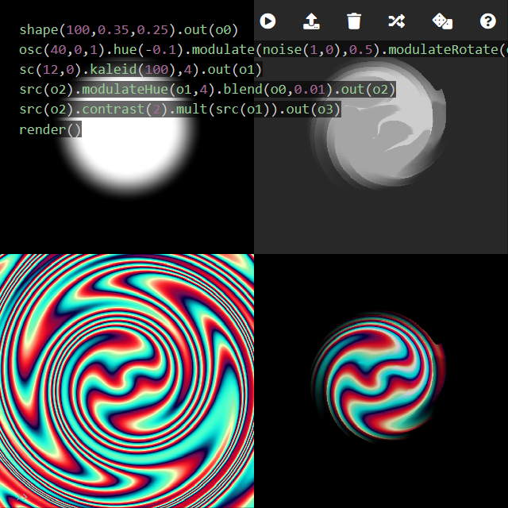

Hydra Book
========

Preface
--------

Hydra is an analog-synth-like coding environment for real-time visuals. It is created by Olivia Jack and is [open-source](https://github.com/ojack/hydra). You can simply open [Hydra editor](https://hydra.ojack.xyz) to start coding. There are a few resources besides this book:

* [The official documentation](https://github.com/ojack/hydra#Getting-Started) is a good resource to get started,
* [Function list](https://github.com/ojack/hydra/blob/master/docs/funcs.md) covers all the functions available in Hydra,
* and [Hydra Patterns on Twitter](https://twitter.com/hydra_patterns) is a way to get inspirations from other artists.

This article is a work-in-progress online book to collect Hydra snippets. Thanks to its live-coding nature, simply improvising by chaining different functions may lead to an unexpected pattern; nevertheless, studying Hydra in a rather systematic way can reveal its potential. Thus, the goal is not only to accumulate frequently-used techniques to make coding easier but also to research the theory of Hydra to discover new images.

### How to Read

If you are new to Hydra, I recommend you to skim through the book and find patterns you like, and try the code by pressing "open in editor" link. You can change some parameters and press `ctrl+shift+enter` to refresh the sketch.

If you are already familiar with Hydra, I hope reading this book gives you some insight not only about "how" to make a pattern but also "why" a pattern emerges.

Table of Contents
--------

* [Textures](textures#textures)
* [Modulation](modulation#modulation)
* [Colors](colors#colors)
* [Arithmetic](arithmetic#arithmetic)
* [Motions](motions#motions)
* [Feedback](feedback#feedback)
* [Custom GLSL](glsl#custom-glsl)
* [JavaScript Tips](javascript#javascript)
* [Performing with Hydra](performing#performing)

License
--------

As described in [LICENSE](https://github.com/micuat/hydra-book/blob/master/LICENSE), this repository is under public domain, meaning that all the contents including code snippets can be used freely without any restrictions. Nevertheless, I appreciate it if you cite this book or simply let [me](https://naotohieda.com) know when you write about any ideas developed from this book!
