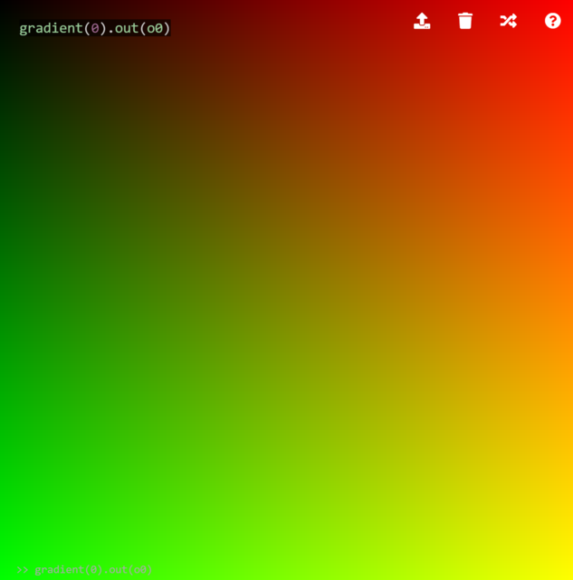
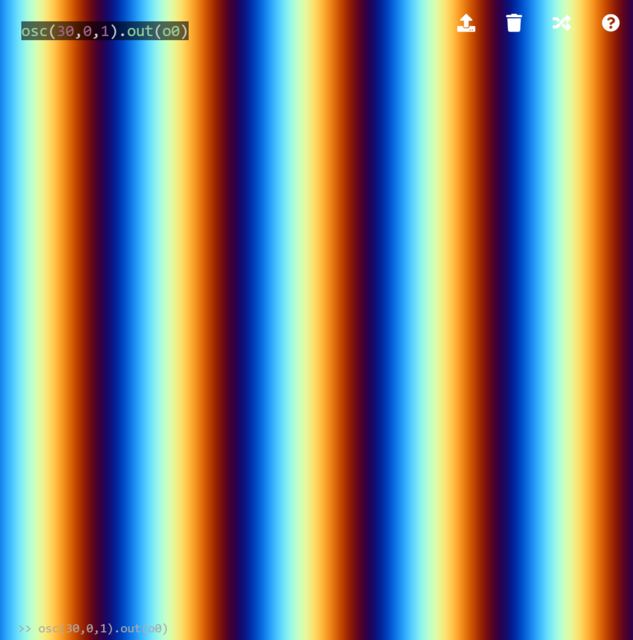
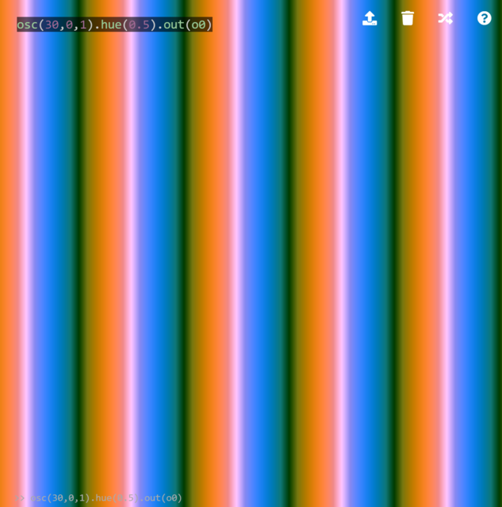
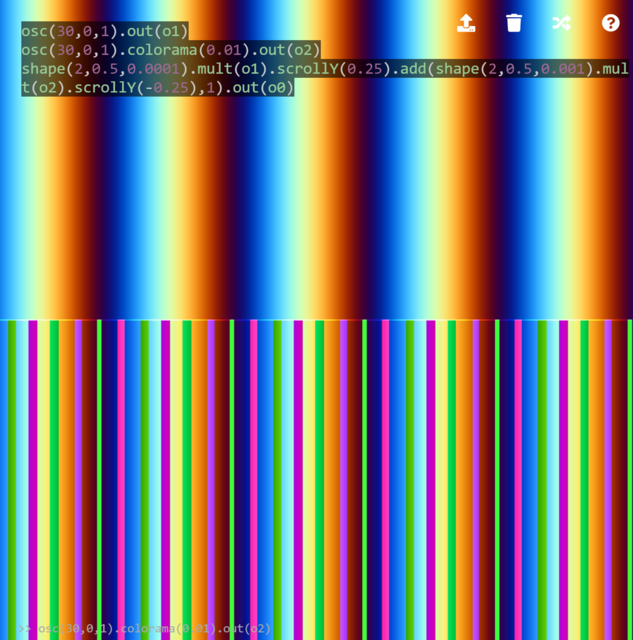
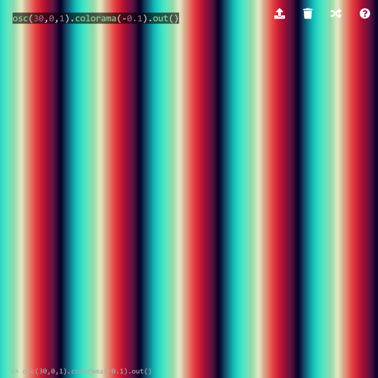
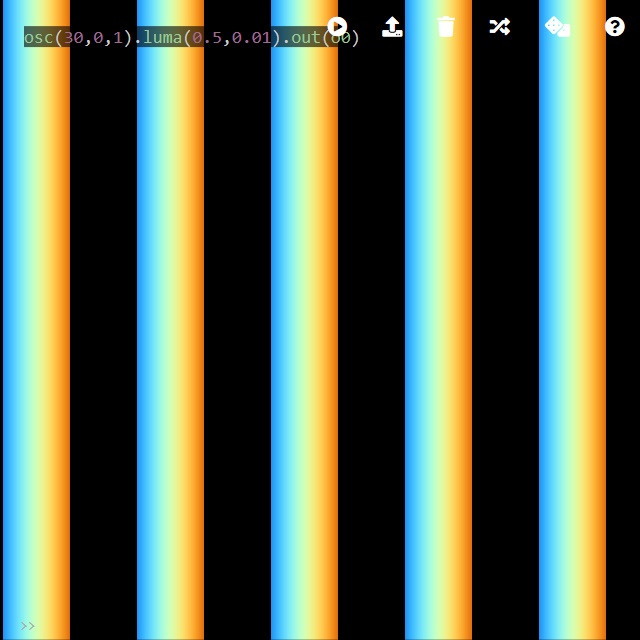
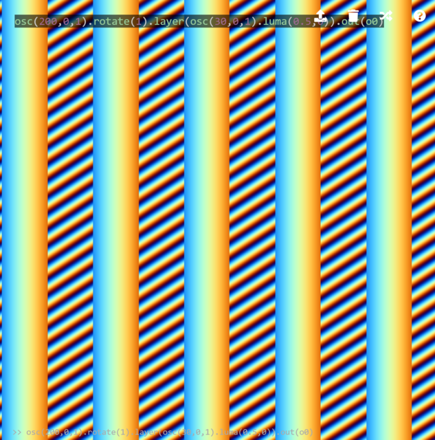
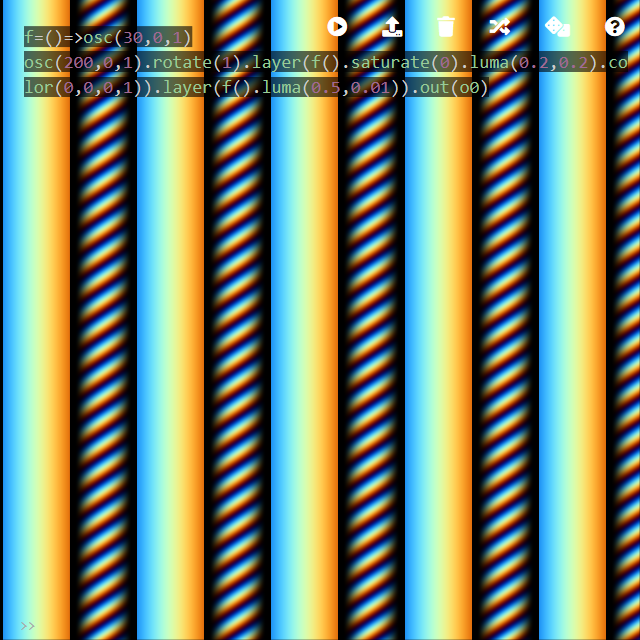
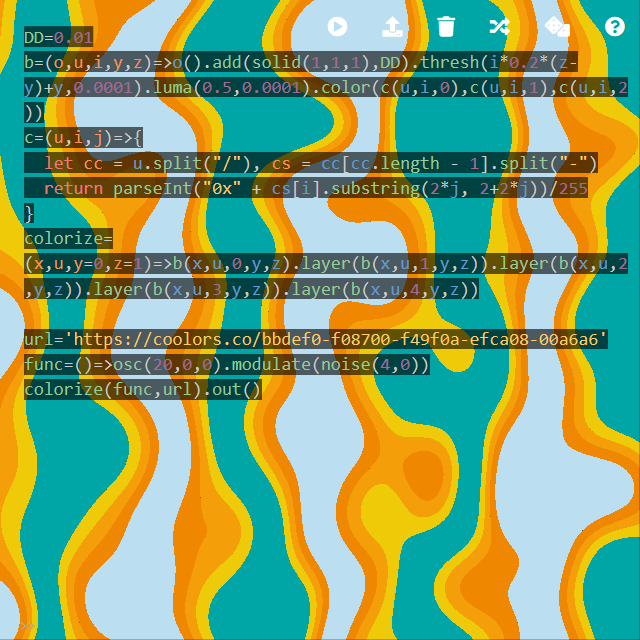

Colors
========

Gradient
--------

`gradient()` is one of the sources to generate a gradient texture. The first argument determines the speed of the color change.

```javascript
gradient(0).out(o0)
```



Oscillator
--------

With the third argument of `osc()`, an oscillator generates a colored texture.

```javascript
osc(10,0,1).out(o0)
```



Color Operations
--------

Although not documented, `hue` is a useful function to shift the hue in HSV (hue, saturation, value) color space. The saturation and brightness of the color are preserved, and only the hue is affected.

```javascript
osc(30,0,1).hue(0.5).out(o0)
```



In contrast, `colorama()` shifts all H, S and V values, implemented as follows:

```clike
vec4 colorama(vec4 c0, float amount){
  vec3 c = _rgbToHsv(c0.rgb);
  c += vec3(amount);
  c = _hsvToRgb(c);
  c = fract(c);
  return vec4(c, c0.a);
}
```

Therefore, the resulting image is rather unpredictable (for explanation, the top part shows the original image (oscillator) and the bottom shows colorama-ed result).

```javascript
osc(30,0,1).colorama(0.01).out(o0)
```



This unpredictability is due to the following reasons. In the GLSL snippet above, first, HSV values are increased by `amount`, and after converting back to RGB, the `fract` value is returned. Since `fract` returns the fraction of the value (equivalent to `x % 1` in JavaScript), any values exceeding 1 will wrap to 0, which causes the discontinuity and unpredictable colors. Therefore, one way to make `colorama` effect less harsh is to set negative value as an argument:

```javascript
osc(30,0,1).colorama(-0.1).out(o0)
```



`luma()` masks an image based on the luminosity. Similar to `thresh()`, however, the color of the bright part of the image is preserved. The first argument is for the threshold, and the second is for the tolerance (with bigger tolerance, the boundary becomes blurrier).

```javascript
osc(30,0,1).luma(0.5,0).out(o0)
```



Importantly, `luma()` returns an image with transparency. Therefore, the image can be overlayed to another image.

```javascript
osc(200,0,1).rotate(1).layer(osc(30,0,1).luma(0.5,0)).out(o0)
```



With the second argument of `luma`, a shadow-like effect can be created. First, turn the texture to grayscale by `saturate(0)`, then use `luma(0.2,0.2)` to create blurred boundaries, and finally `color(0,0,0,1)` to convert grayscale to an alpha mask with black color. In the example, foreground texture `f()` is defined for convenience to avoid duplication for shadow generation and foreground rendering. The shadow texture is overlaid on the background texture `osc(200,0,1)` and then the foreground texture `f()` is overlaid on the shadow texture.

```javascript
f=()=>osc(30,0,1)
osc(200,0,1).rotate(1).layer(f().saturate(0).luma(0.2,0.2).color(0,0,0,1)).layer(f().luma(0.5,0)).out(o0)
```



Color Remapping
--------

The above examples give "video synthesizer" like colors. But what if you want to use colors from a palette, for example, specified by RGB hexadecimal numbers? In the next example, a grayscale texture is re-colored by a palette taken from [coolors.co](https://coolors.co).

```javascript
DD=0.01
b=(o,u,i,y,z)=>o().add(solid(1,1,1),DD).thresh(i*0.2*(z-y)+y,0).luma(0.5,0).color(c(u,i,0),c(u,i,1),c(u,i,2))
c=(u,i,j)=>{
  let cc = u.split("/"), cs = cc[cc.length - 1].split("-")
  return parseInt("0x" + cs[i].substring(2*j, 2+2*j))/255
}
colorize=(x,u,y=0,z=1)=>b(x,u,0,y,z).layer(b(x,u,1,y,z)).layer(b(x,u,2,y,z)).layer(b(x,u,3,y,z)).layer(b(x,u,4,y,z))

url='https://coolors.co/bbdef0-f08700-f49f0a-efca08-00a6a6'
func=()=>osc(20,0,0).modulate(noise(4,0))
colorize(func,url).out()
```



While the example code is long, in a nutshell, the input grayscale texture defined by `func` is separated into 5 layers based on the intensity, and each layer is recolored by the hexadecimal number specified in coolors URL. The GIF animation below shows each layer recolored for explanation. At the end, these layers are overlaid on top of each other to produce the final texture (above).


Feedback
--------

A feedback loop can be used to create unexpected color effects. For example, based on an example from [Scaling](#scaling), a periodic color texture can be generated.

```javascript
shape(4,0.7,0).add(src(o0).scrollX(0.01).scrollY(0.01).color(1,1,0).hue(0.1),-1).out(o0)
```


