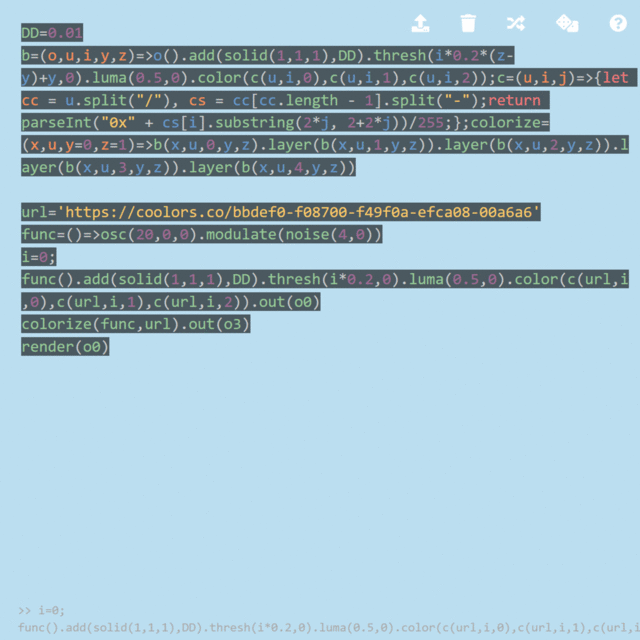
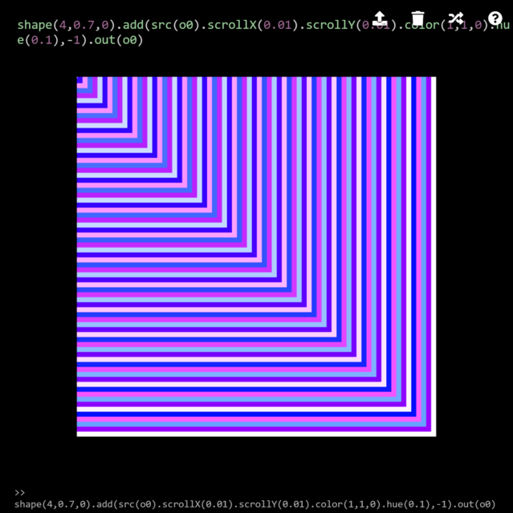

Colors
========

Gradient
--------

`gradient()` is one of the sources to generate a gradient texture. The first argument determines the speed of the color change.

```javascript
gradient(0).out(o0)
```

Oscillator
--------

With the third argument `offset` of `osc()`, an oscillator generates a colored texture. The parameter cycles from 0 to `PI*2`, which shifts the phase of R, G, B channels. A rainbow effect can be most visible at `offset=Math.PI/2`:

```javascript
osc(30,0,Math.PI/2).out(o0)
```

At `offset=Math.PI`, the red and blue channels have the same phase:

```javascript
osc(30,0,Math.PI).out(o0)
```

Color Operations
--------

### hue

Although not documented, `hue(hue)` is a useful function to shift the hue in HSV (hue, saturation, value) color space. The saturation and brightness of the color are preserved, and only the hue is affected.

```javascript
osc(30,0,1).hue(0.5).out(o0)
```

`hue()` is often useful to combine with feedback. In this example, `o0` is gradually modulated and its hue is shifted at the same time.

```javascript
src(o0).modulateRotate(noise(2,0),0.03).hue(0.003).layer(shape(2,0.125).luma().color(0,0,1)).out(o0)
```

### colorama

In contrast, `colorama()` shifts all H, S and V values, implemented as follows:

```clike
vec4 colorama(vec4 c0, float amount){
  vec3 c = _rgbToHsv(c0.rgb);
  c += vec3(amount);
  c = _hsvToRgb(c);
  c = fract(c);
  return vec4(c, c0.a);
}
```

Therefore, the resulting image is rather unpredictable (for explanation, the top part shows the original image (oscillator) and the bottom shows colorama-ed result).

```javascript
osc(30,0,1).out(o0)
osc(30,0,1).colorama(0.01).out(o1)
render()
```

This unpredictability is due to the following reasons. In the GLSL snippet above, first, HSV values are increased by `amount`, and after converting back to RGB, the `fract` value is returned. Since `fract` returns the fraction of the value (equivalent to `x % 1` in JavaScript), any values exceeding 1 will wrap to 0, which causes the discontinuity and unpredictable colors. Therefore, one way to make `colorama` effect less harsh is to set negative value as an argument:

```javascript
osc(30,0,1).colorama(-0.1).out(o0)
```

### luma

`luma(threshold,tolerance)` masks an image based on the luminosity. Similar to `thresh()`, however, the color of the bright part of the image is preserved. `threshold` is for the threshold, and `tolerance` sets the blurriness (with bigger tolerance, the boundary becomes blurrier, and same as `threshold`, the value cannot be 0).

```javascript
osc(30,0,1).luma(0.5,0.01).out(o0)
```

Importantly, `luma()` returns an image with transparency. Therefore, the image can be overlayed to another image.

```javascript
osc(200,0,1).rotate(1).layer(osc(30,0,1).luma(0.5,0.01)).out(o0)
```

With the second argument of `luma`, a shadow-like effect can be created. First, turn the texture to grayscale by `saturate(0)`, then use `luma(0.2,0.2)` to create blurred boundaries, and finally `color(0,0,0,1)` to convert grayscale to an alpha mask with black color. In the example, foreground texture `f()` is defined for convenience to avoid duplication for shadow generation and foreground rendering. The shadow texture is overlaid on the background texture `osc(200,0,1)` and then the foreground texture `f()` is overlaid on the shadow texture.

```javascript
f=()=>osc(30,0,1)
osc(200,0,1).rotate(1).layer(f().saturate(0).luma(0.2,0.2).color(0,0,0,1)).layer(f().luma(0.5,0.01)).out(o0)
```

Color Remapping
--------

The above examples give "video synthesizer" like colors. But what if you want to use colors from a palette, for example, specified by RGB hexadecimal numbers? In the next example, a grayscale texture is re-colored in several methods.

### Mapping intensity to palette

The first method attempts to map grayscale (intensity) texture to a palette, or a color scheme.

```javascript
osc(Math.PI*2,0,2).modulate(noise(3,0).add(gradient(),-1),1).out(o0)
```

Let's break this one-liner to four buffers for explanation.

```javascript
noise(3,0).out(o0)
src(o0).add(gradient(),-1).out(o1)
osc(Math.PI*2,0,2).out(o2)
src(o2).modulate(noise(3,0).add(gradient(),-1),1).out(o3)
render()
```

The first buffer `o0` is the grayscale image to be remapped (in fact, as explained earlier, `noise` outputs [-1 1] instead of [0 1]). As the second buffer is complicated, we skip this; the third buffer `o2` (top right) is the new palette. In this example, an oscillator is used to make a smooth gradient. Black color in `o0` will be mapped to the pixels on the left, and white to the pixels in the right. The fourth buffer is the result.

The second buffer is used as the "modulator". In the screenshot (bottom left), it appears blank. You may wonder why add gradient, and with the second argument -1. Let's take a look at the code snippet from [modulation](modulation#modulation) chapter.

```clike
Pixel[][] A; // palette
Pixel[][] B; // intensity
Pixel[][] ANew; // remapped texture
for(int y = 0; y < height; y++) {
  for(int x = 0; x < width; x++) {
    Pixel b = B[y][x];
    ANew[y][x] = A[y + b.green][x + b.red];
  }  
}
```

For simplicity, modulation `amount` is set to 1. For color remapping, we need to map `B`'s color value (0 - 1) to `A`'s x value (0 - 1). Therefore,

```clike
    ANew[y][x] = A[0][b.red];
```

assuming that b.red == b.green == b.blue. To do so, we need to cancel out `x` and `y` in the array indices; we need the modulator `B`'s values to be

```clike
b.red = -x + b.red;
b.green = -y;
```

`gradient` with default parameter directly maps the pixel position to red and green. Given that Hydra uses normalized coordinates (x=0, y=0 at the top left, x=1, y=1 at the bottom right), `add(gradient(), -1)` will result in `-x` and `-y`; therefore, with modulation `amount` 1, we can achieve the second code snippet.

Technically, the example above will sample the palette diagonally from the top left to the bottom right. This becomes a problem if the palette texture has variation in y direction, such as `gradient()`:

```javascript
gradient().modulate(noise(3,0).add(gradient(),-1),1).out(o0)
```

If you want to want to sample in the center of the palette at y=0.5, one way is to do arithmetic operations:

```javascript
gradient().modulate(noise(3,0).color(1,0,0).add(solid(0,0.5)).add(gradient(),-1),1).out(o0)
```

However, an easier way is to stretch the palette in the y axis using `scale()`:

```javascript
gradient().scale(1,1,1000).modulate(noise(3,0).add(gradient(),-1),1).out(o0)
```

In some environments, you may need to add `color(0.99,0.99,0.99)` to the intensity texture to avoid texture wrapping.

### Using coolors

(Although this method is *deprecated*, this section is kept as a reference)

Here, we use a palette taken from [coolors.co](https://coolors.co).

```javascript
DD=0.01
b=(o,u,i,y,z)=>o().add(solid(1,1,1),DD).thresh(i*0.2*(z-y)+y,0.0001).luma(0.5,0.0001).color(c(u,i,0),c(u,i,1),c(u,i,2))
c=(u,i,j)=>{
  let cc = u.split("/"), cs = cc[cc.length - 1].split("-")
  return parseInt("0x" + cs[i].substring(2*j, 2+2*j))/255
}
colorize=(x,u,y=0,z=1)=>b(x,u,0,y,z).layer(b(x,u,1,y,z)).layer(b(x,u,2,y,z)).layer(b(x,u,3,y,z)).layer(b(x,u,4,y,z))

url='https://coolors.co/bbdef0-f08700-f49f0a-efca08-00a6a6'
func=()=>osc(20,0,0).modulate(noise(4,0))
colorize(func,url).out()
```

While the example code is long, in a nutshell, the input grayscale texture defined by `func` is separated into 5 layers based on the intensity, and each layer is recolored by the hexadecimal number specified in coolors URL. The GIF animation below shows each layer recolored for explanation. At the end, these layers are overlaid on top of each other to produce the final texture (above).



<!-- Feedback
--------

A feedback loop can be used to create unexpected color effects. For example, based on an example from [Scaling](#scaling), a periodic color texture can be generated.

```javascript
shape(4,0.7,0).add(src(o0).scrollX(0.01).scrollY(0.01).color(1,1,0).hue(0.1),-1).out(o0)
```

 -->

