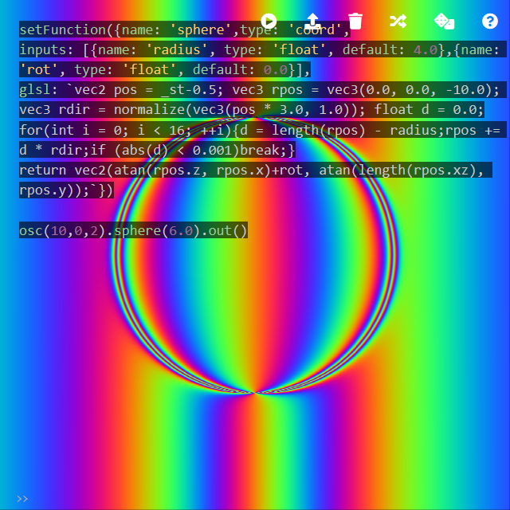
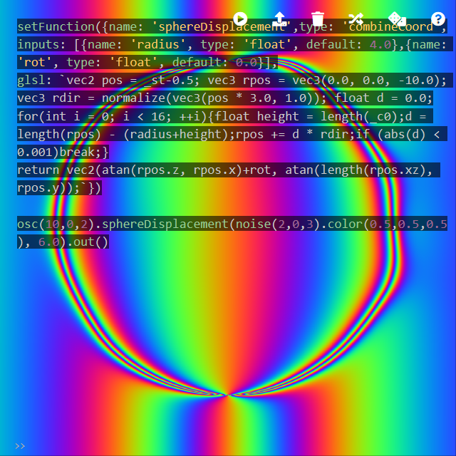
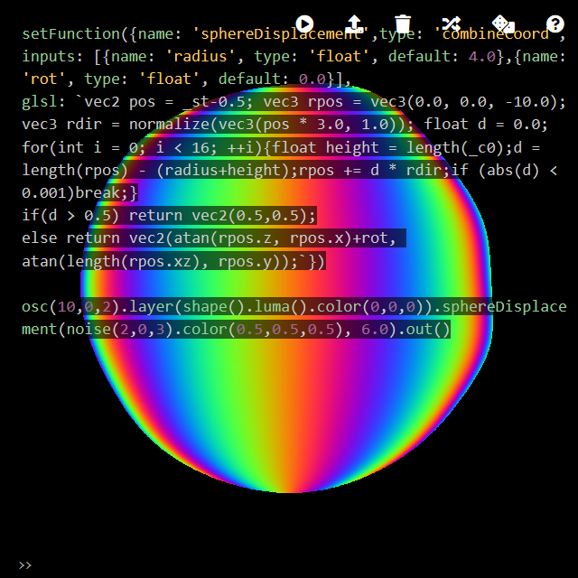

Custom GLSL
========

setFunction
--------

A custom GLSL function can be defined using `setFunction()`. The structure follows the format of [builtin functions](https://github.com/ojack/hydra-synth/blob/master/src/glsl/glsl-functions.js). Defining a custom GLSL function does not mean that you are allowed to design an arbitrary function; the function has to have specific inputs and an output, based on its type. The types are `src` `color` `combine` `combineCoords`.

In this example, a simple ray marching is implemented as a `coord` function, which literally modifies the coordinates, to map incoming texture to a sphere.

```javascript
setFunction({
  name: 'sphere',type: 'coord',
  inputs: [
    {name: 'radius', type: 'float', default: 4.0},
    {name: 'rot', type: 'float', default: 0.0}
  ],
  glsl: `
  vec2 pos = _st-0.5;
  vec3 rpos = vec3(0.0, 0.0, -10.0);
  vec3 rdir = normalize(vec3(pos * 3.0, 1.0));
  float d = 0.0;
  for(int i = 0; i < 16; ++i){
    d = length(rpos) - radius;
    rpos += d * rdir;
    if (abs(d) < 0.001)break;
  }
  return vec2(atan(rpos.z, rpos.x)+rot, atan(length(rpos.xz), rpos.y));
`})

osc(10,0,2).sphere(6.0).out()
```



A noise input can be added as an argument to displace the sphere surface. This can be done with `combineCoord` type, which is used by `modulate*` family.

```javascript
setFunction({
  name: 'sphereDisplacement',type: 'combineCoord',
  inputs: [
    {name: 'radius', type: 'float', default: 4.0},
    {name: 'rot', type: 'float', default: 0.0}
  ],
  glsl: `
  vec2 pos = _st-0.5;
  vec3 rpos = vec3(0.0, 0.0, -10.0);
  vec3 rdir = normalize(vec3(pos * 3.0, 1.0));
  float d = 0.0;
  for(int i = 0; i < 16; ++i){
    float height = length(_c0);
    d = length(rpos) - (radius+height);
    rpos += d * rdir;
    if (abs(d) < 0.001)break;
  }
  return vec2(atan(rpos.z, rpos.x)+rot, atan(length(rpos.xz), rpos.y));
`})

osc(10,0,2).sphereDisplacement(noise(2,0,3).color(0.5,0.5,0.5), 6.0).out()
```



It can be hacked to set the background image.

```javascript
setFunction({
  name: 'sphereDisplacement2',
  type: 'combineCoord',
  inputs: [
    {name: 'radius', type: 'float', default: 4.0},
    {name: 'rot', type: 'float', default: 0.0}
  ],
  glsl: `
  vec2 pos = _st-0.5;
  vec3 rpos = vec3(0.0, 0.0, -10.0);
  vec3 rdir = normalize(vec3(pos * 3.0, 1.0));
  float d = 0.0;
  for(int i = 0; i < 16; ++i){
    float height = length(_c0);
    d = length(rpos) - (radius+height);
    rpos += d * rdir;
    if (abs(d) < 0.001)break;
  }
  if(d > 0.5) return vec2(0.5,0.5);
  else return vec2(atan(rpos.z, rpos.x)+rot, atan(length(rpos.xz), rpos.y));
`})

osc(10,0,2).layer(shape().luma().color(0,0,0)).sphereDisplacement2(noise(2,0,3).color(0.5,0.5,0.5), 6.0).out()
```


