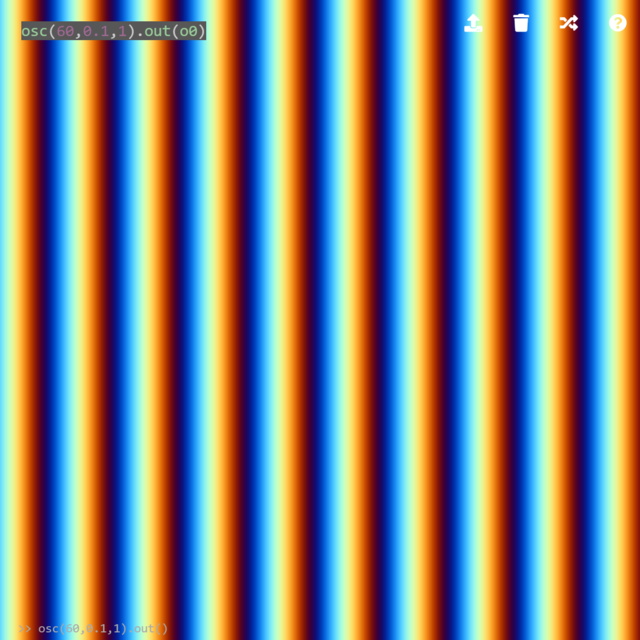
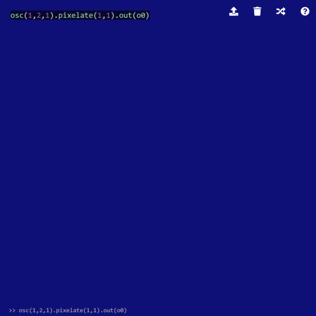
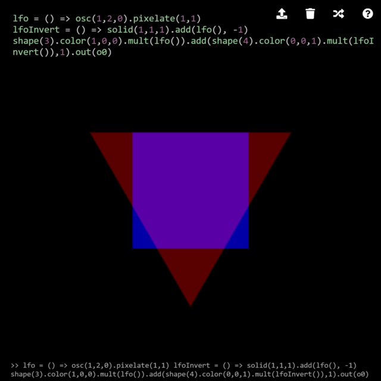
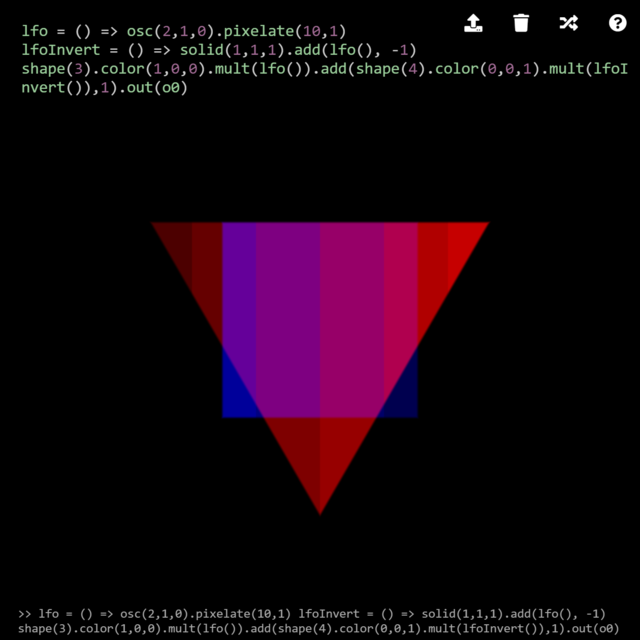
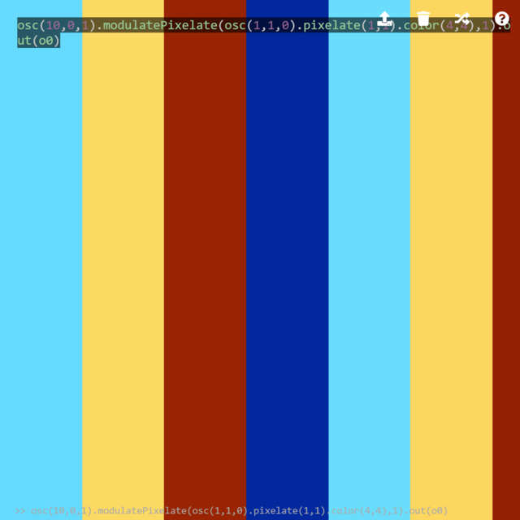
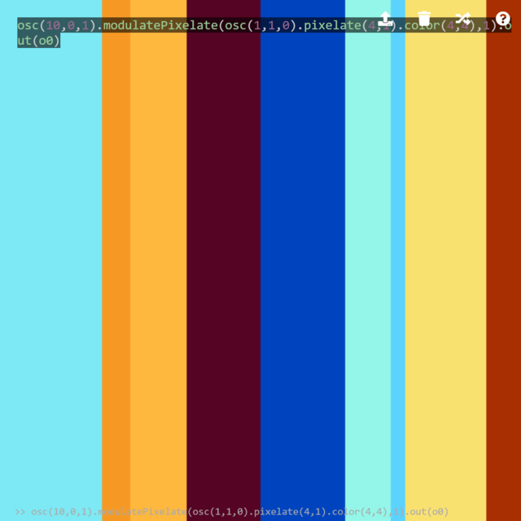

Motions
========

Low Frequency Oscillator
--------

In audiovisual synthesis, a term low frequency oscillator (LFO) is often used. According to [Wikipedia](https://en.wikipedia.org/wiki/Low-frequency_oscillation), an oscillator with a frequency below 20 Hz is usually considered as an LFO; nevertheless, the definition depends on the application, and here, I would not define the frequency (in fact, most LCDs support up to 60 Hz, and effectively, what can be displayed on an LCD is LFO). The important point is that, in this section, we strictly look at oscillators in the time domain. In the previous chapters, oscillators are explained in the spatial domain, i.e., the pixel space. If the second argument of `osc` is set to a non-zero value, the pattern starts to "move."

```javascript
osc(60,0.1,1).out(o0)
```


*In this book, the images are static. Please try the code on the Hydra editor to watch the movement.*

The result seems to be scrolling stripes due to the human perception. If we look at an oscillator with a smaller spatial frequency (i.e., to set the first argument small), and take an average of the whole pixels by `pixelate(1,1)`, the color change in time becomes recognizable.

```javascript
osc(1,2,1).pixelate(1,1).out(o0)
```



This is not particularly an interesting example. Yet, it is important to separate the characteristics in the time and spatial domains. For instance, the sine wave oscillator in the example above can be used as a fader to mix two images:

```javascript
lfo = () => osc(1,2,0).pixelate(1,1)
lfoInvert = () => solid(1,1,1).add(lfo(), -1)
shape(3).color(1,0,0).mult(lfo()).add(shape(4).color(0,0,1).mult(lfoInvert()),1).out(o0)
```

A similar effect can be achieved by an arrow function:

```javascript
shape(3).color(1,0,0).blend(shape(4).color(0,0,1), () => Math.sin(time) * 0.5 + 0.5).out(o0)
```



Visually, both examples crossfade the two shapes: a red triangle and a blue square. The key is to understand the difference between these two examples. In the first code, the two shapes are multiplied by `lfo` and `lfoInvert`, which is the inverted texture of `lfo`. This can be thought as an analogy of a layer mask with a uniform transparency in Photoshop. In the second code, an arrow function with `Math.sin` is attached to the second argument of `blend`. This is similar to setting a global opacity of the layer in Photoshop. The latter is more concise and easier to understand. However, it is spatially less flexible because the single transparency is applied to the blending operation of all the pixels. The former can be modified to add spatial oscillation, i.e., a layer mask.

```javascript
lfo = () => osc(2,1,0).pixelate(10,1)
lfoInvert = () => solid(1,1,1).add(lfo(), -1)
shape(3).color(1,0,0).mult(lfo()).add(shape(4).color(0,0,1).mult(lfoInvert()),1).out(o0)
```



Beyond image blending, LFOs can be used for other several operations. An example is `pixelate`. To change the argument of `pixelate` in time, one might use an arrow function:

```javascript
lfo = () => (Math.sin(time) * 0.5 + 0.5) * 4 + 4
osc(10,0,1).pixelate(lfo,lfo).out(o0)
```

Note that `lfo` function itself is passed to `pixelate`, not `lfo()` function call. When `lfo()` is passed, it is only evaluated once and you will not see any change in the image. A similar texture can be generated using `modulatePixelate`:

```javascript
osc(10,0,1).modulatePixelate(osc(1,1,0).pixelate(1,1).color(4,4),1).out(o0)
```



Again, the difference of the two example is the flexibility in the spatial domain. By increasing the number of `pixelate` in the later example, you can apply different pixelation operations to each segment of the texture.

```javascript
osc(10,0,1).modulatePixelate(osc(1,1,0).pixelate(4,1).color(4,4),1).out(o0)
```



The downside of the `osc.pixelate` LFO compared to an arrow-function LFO is that arithmetic operations are cumbersome and less readable. To add a value X, one needs to write

```clike
...add(solid(1,1,1),X)
```

And to multiply by Y,

```clike
...color(Y,Y,Y)
```

Also, such an LFO has fewer mathematical functions. Nevertheless, discretization can be achieved by `thresh` or `posterize`:

```javascript
osc(10,0,1).modulatePixelate(osc(1,1,0).pixelate(1,1).posterize(16,1).color(4,4),1).out(o0)
```

which is similar to `Math.floor`:

```javascript
lfo = () => Math.floor((Math.sin(time) * 0.5 + 0.5) * 4 * 16) / 16
osc(10,0,1).pixelate(lfo,lfo).out(o0)
```

and similarly achieved by the JavaScript array extension in Hydra:

```javascript
lfo = [1,2,3,4].fast(2)
osc(10,0,1).pixelate(lfo,lfo).out(o0)
```

A screenshot is omitted because a static image would appear similar to the previous example. The same technique can be applied in conjunction with other modulation functions such as `modulateScrollX`.
