Textures
========

In this chapter, we discuss textures or patterns, separately from colors or movements. Most of the snippets have low saturation and no movements in order to separate textures from other effects.

Oscillator
--------

`osc()` is one of the basic sources to create a texture. The first argument determines the frequency (i.e., how packed the stripes are), the second for the sync (i.e., the scroll speed), and the third for the offset, which adds color to the pattern (if you are curious, one cycle of an oscillator in the screen space can be achieved by `osc(Math.PI * 2)`).

```javascript
osc(40,0).out(o0)
```

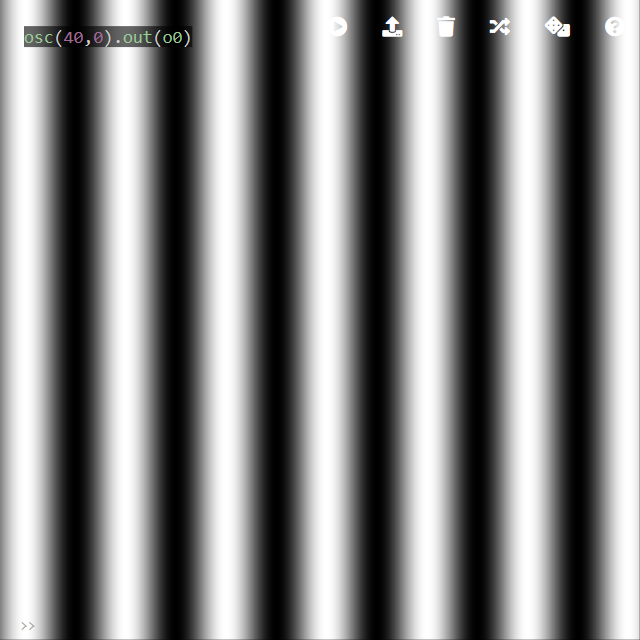

By adding `thresh()` or `posterize()`, the oscillator pattern becomes clear stripes. `thresh(threshold)` literally thresholds the grayscale value; if the pixel's grayscale is brighter than `threshold`, returns white and else returns black (alpha is preserved). `posterize(bins,gamma)` thresholds with multiple steps, similar to histogram. `pixelate()` achieves a similar effect; however, the offset between the bumps of the oscillator and the pixelation bins can create artifacts.

(`render()` displays four buffers; `o0` on top left, `o1` on bottom left, `o2` on top right and `o3` on bottom right)

```javascript
osc(40,0).out(o0)
src(o0).thresh().out(o1)
src(o0).posterize(3,1).out(o2)
src(o0).pixelate(20, 20).out(o3)
render()
```

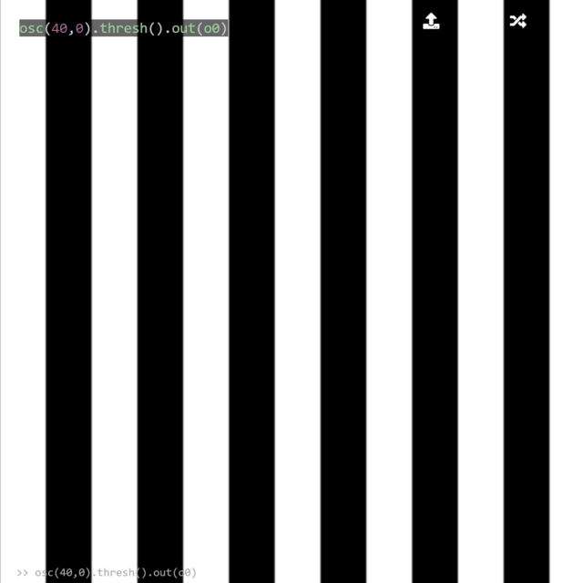

`kaleid()` with a large number creates circles,

```javascript
osc(200, 0).kaleid(200).out(o0)
```

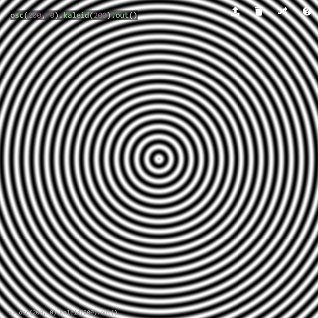

However, this sketch will be distorted if the window is not square. `scale(amount,x,y)` can correct the scaling; it scales `amount*x` to x-axis and `amount*y` to y-axis. Therefore, `scale(1,1,16/9)` fits the sketch to 16:9 window, and in general,

```javascript
osc(200, 0).kaleid(200).scale(1,1,()=>window.innerWidth/window.innerHeight).out(o0)
```

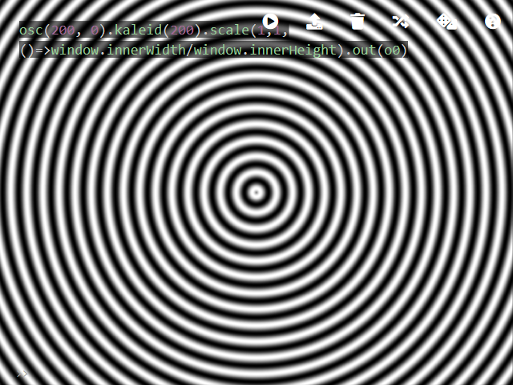

adapts the sketch to any size of the window. Notice `()=>`, which is an arrow function. If a value is passed to a hydra function (e.g., `scale(1,1,window.innerWidth/window.innerHeight)`), it will be evaluated only once when `ctrl+enter` or `ctrl+shift+enter` is pressed. However, an arrow function is evaluated every frame; thus, it becomes responsive to the window size change. In the rest of the book, a square window is assumed for simplicity.

`kaleid` with a small number creates a geometric shape (in the example, an oscillator is combined with `kaleid` and `thresh`).

```javascript
osc(40,0).thresh().kaleid(3).out(o0)
```

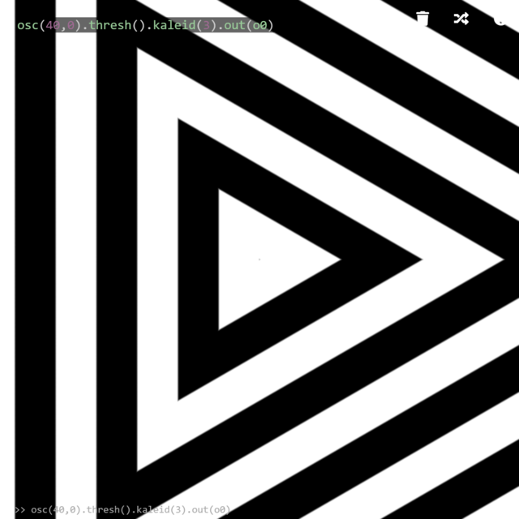

Noise
--------

`noise()` is another basic function as a source. A texture is generated based on a variant of Perlin Noise.

```javascript
noise(10, 0).out(o0)
```

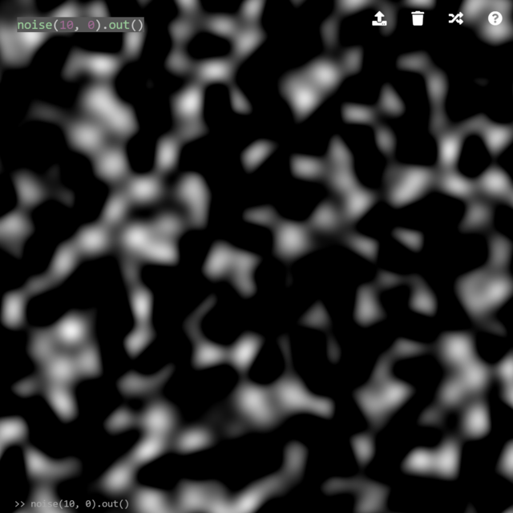

We will look more into detail in the modulator section.

Voronoi
--------

`voronoi()` is a source to generate a Voronoi diagram.

```javascript
voronoi(10, 0).out(o0)
```

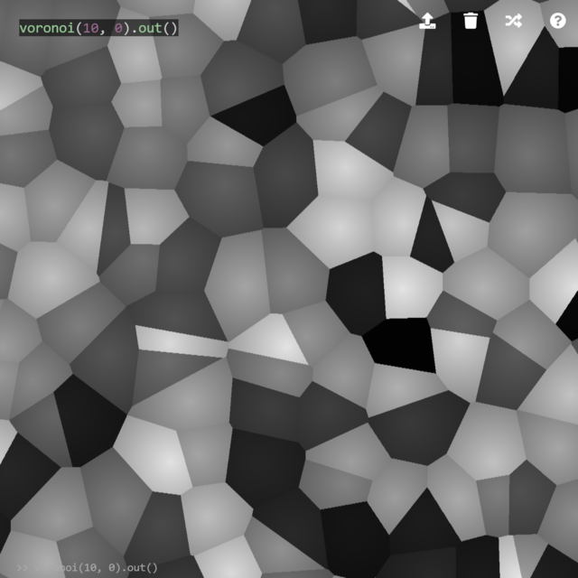

Shapes
--------

`shape(sides,radius,smoothing)` generates a polygon with a number of sides set by `sides`. Nevertheless, it is more than just a polygon - `radius` changes the size of the shape, and most importantly, `smoothing` sets gradient of the shape; 1 for fuzzy borders and close to 0 for sharp edges (however, setting to 0 does not work in recent versions). For example, `shape(2)` is a thick line, which can be scaled to make a thin line.

```javascript
shape(2).scale(0.01).out(o0)
```

or simply,

```javascript
shape(2,0.0025,0.001).out(o0)
```

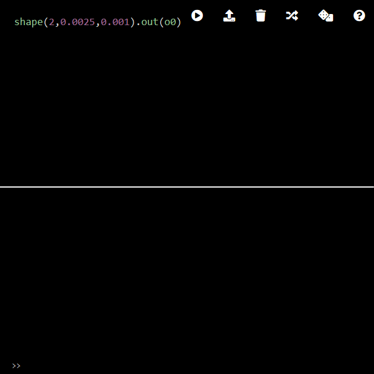

By repeating `shape(4)` and overlapping them, it gives a grid-like pattern. For convenience, a parameter and a function are stored in JavaScript variables.

```javascript
n = 4
a = () => shape(4,0.4).repeat(n,n)
a().add(a().scrollX(0.5/n).scrollY(0.5/n),1).out()
```

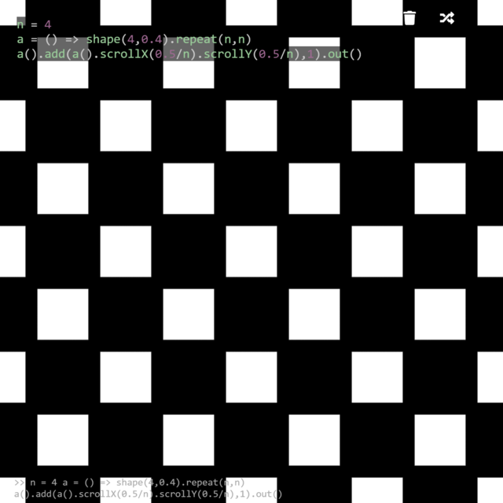

Similar to `kaleid()`, `shape()` with a large number of sides creates a circle. By tweaking the example above, it generates a Polka dot pattern.

```javascript
n = 4
a= () => shape(400,0.5).repeat(n,n)
a().add(a().scrollX(0.5/n).scrollY(0.5/n),1).out()
```

or almost equivalent with (the center of the image will be horizontally shifted)

```javascript
n = 8/Math.sqrt(2)
a = () => shape(400,0.75).repeat(n,n)
a().rotate(Math.PI/4).out()
```

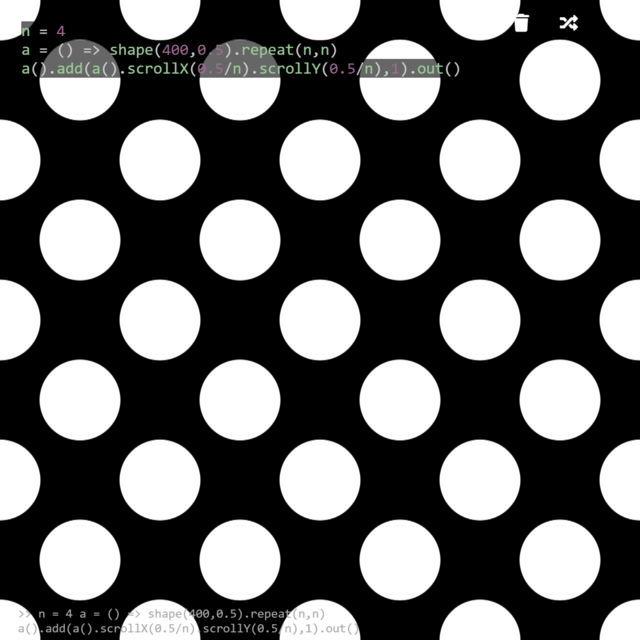

This tiling technique can be used to create a RGB pixel filter. In this example, `func` is decomposed into R, G, and B channels and overlaid on top of each other.

```javascript
n = 50;
func = () => osc(30,0.0,1).modulate(noise(4,0))
pix = () => shape(4,0.3).scale(1,1,3).repeat(n,n)
pix().mult(func().color(1,0,0).pixelate(n,n)).out(o1)
pix().mult(func().color(0,1,0).pixelate(n,n)).scrollX(1/n/3).out(o2)
pix().mult(func().color(0,0,1).pixelate(n,n)).scrollX(2/n/3).out(o3)

solid().add(src(o1),1).add(src(o2),1).add(src(o3),1).out(o0)
```

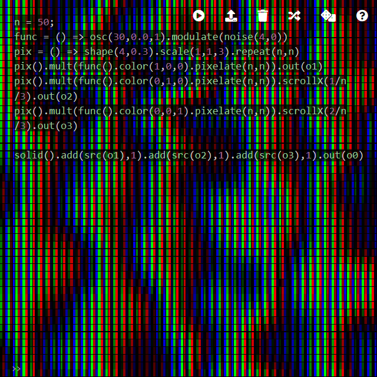

Modulator
--------

Modulators are the key component in Hydra. Let's look at this example; the modulated function `osc()` is on top left, the modulating function `noise()` is on bottom left, and the result is on top right.

```javascript
osc(40,0,1).out(o0)
noise(3,0).out(o1)
osc(40,0,1).modulate(noise(3,0)).out(o2)
render()
```

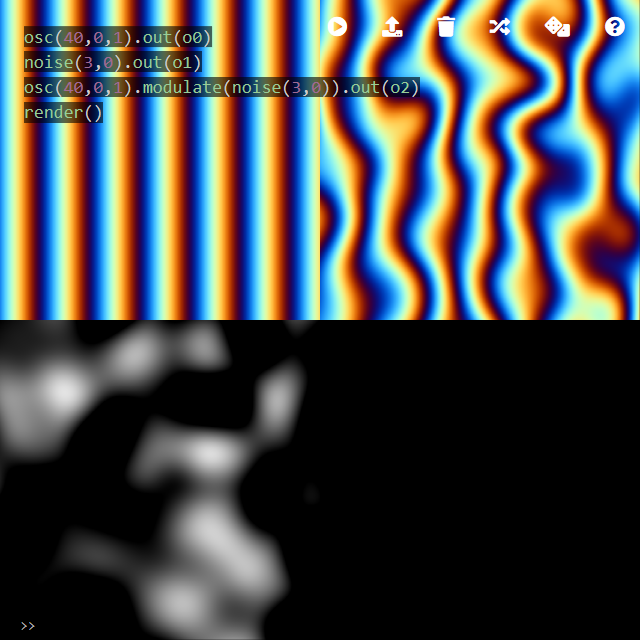

We can see this from two perspectives. First, the color of the original image (or modulated image, `osc(40,0,1)`) is preserved. Second, the oscillator is distorted to resemble the pattern of the modulating texture, `noise(3,0)`. Modulators can be seen from two different perspectives. On the one hand, a modulator literally modulates (or distorts) the chained function (`osc` in this example). In this section, we cover this aspect to explore the distortion. On the other hand, it can be seen as a way to paint the modulator function (`noise` in this example). For example, `noise` itself is grayscale, but using it as an argument of a modulator, the noise pattern is painted with, for example, an oscillator or a gradient.

### modulate

Here is a pseudocode of `A.modulate(B, amount)` producing `ANew`. This might be helpful if you are already familiar with coding environments such as Processing and openFrameworks.

```clike
Pixel[][] A;
Pixel[][] B;
Pixel[][] ANew;
for(int y = 0; y < height; y++) {
  for(int x = 0; x < width; x++) {
    Pixel b = B[y][x];
    ANew[y][x] = A[y + b.green * amount][x + b.red * amount];
  }  
}
```

A modulator with a feedback loop keeps *pushing* pixels based on its brightness. In this example, a noise is modulated by itself in a feedback loop. As a result, bright pixels are pushed further and further, creating a smooth, 3D-like effect.

```javascript
noise(10, 0).modulate(o0).blend(o0,0.9).out(o0)
```

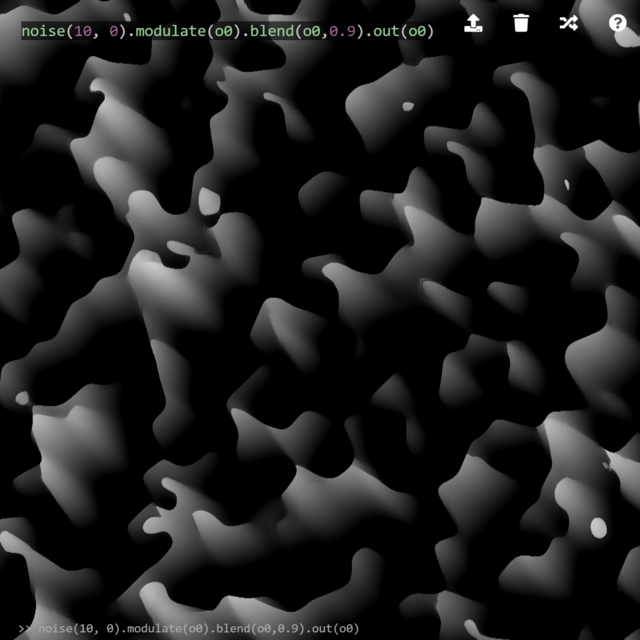

This example uses the same technique on a Voronoi diagram. Similar to above, the resulting image has a fake 3D look.

```javascript
voronoi(10, 0).modulate(o0).blend(o0,0.9).out(o0)
```

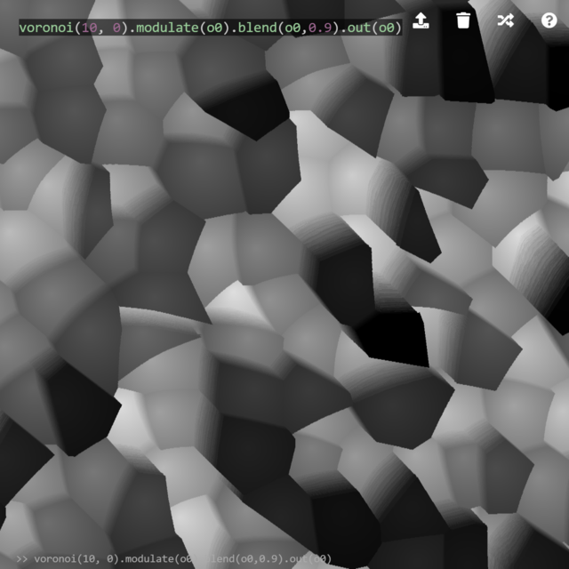

In the examples above, modulating functions are grayscale, so pixels are always pushed to left-up direction with varying amplitude (positive direction is right and down for x and y, respectively, but *pushing* happens to the other direction as modulation is look-up). By adding color channels, and by remapping color values from `[0, 1]` to, for example, `[-1, 1]`, pixels are pushed to all directions. This can be achieved by `add(solid(1,1),-0.5)` (notice that only red and green are selected because blue channel is ignored by a modulator).

```javascript
shape(4,0.5).out(o0)
osc(10,0,1).modulate(noise(2,0),0.5).out(o1)
src(o2).modulate(src(o1).add(solid(1,1),-0.5),0.01).blend(o0,0.01).out(o2)
render()
```

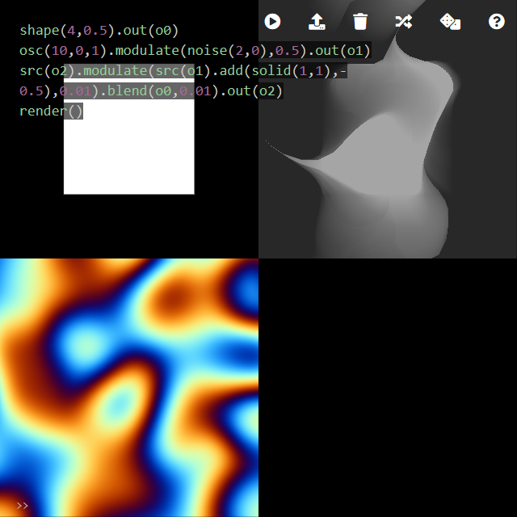

This texture can be further developed by modifying the modulating buffer using `luma()`

```javascript
shape(4,0.5).out(o0)
osc(10,0,1).modulate(noise(2,0),0.5).luma(0.7).out(o1)
src(o2).modulate(src(o1).add(solid(1,1),-0.5),0.01).blend(o0,0.01).out(o2)
render()
```

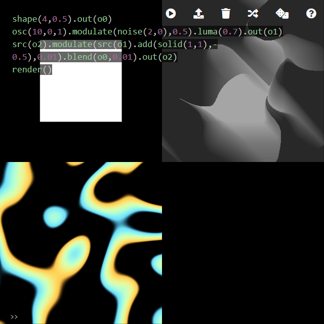

or `posterize()`

```javascript
shape(4,0.5).out(o0)
osc(10,0,1).modulate(noise(2,0),0.5).posterize(4).out(o1)
src(o2).modulate(src(o1).add(solid(1,1),-0.5),0.01).blend(o0,0.01).out(o2)
render()
```

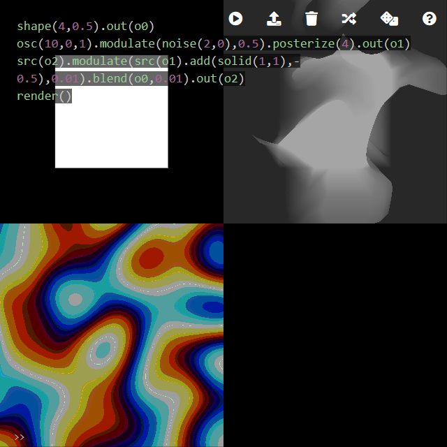

### modulateHue

`modulateHue(src,amount)` behaves similar to `modulate()`; however, the pixel shift can happen to negative directions and also it uses blue channel (however, it does not use hue values as the name suggests):

```clike
return _st + (vec2(_c0.g - _c0.r, _c0.b - _c0.g) * amount * 1.0/resolution);
```

```javascript
shape(4,0.5).out(o0)
osc(10,0,1).modulate(noise(2,0),0.5).hue(-0.1).out(o1)
src(o2).modulateHue(o1,8).blend(o0,0.01).out(o2)
src(o2).luma(0.3,0.3).mult(o1).out(o3)
render()
```

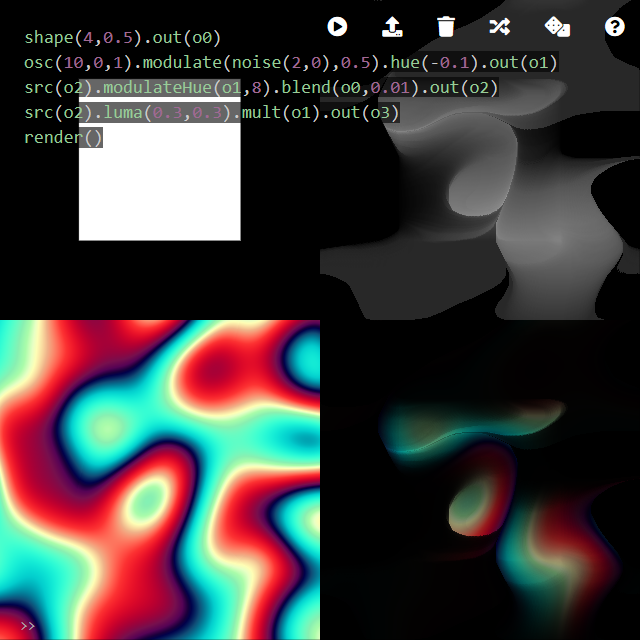

### modulateScale

`modulateScale` is a variant of `modulate`. The original `modulate` translates the texture coordinate by `(r, g)` which is the color of modulating texture; `modulateScale` scales the pixel position by `(r, g)`. Simply applying `modulateScale` can create huge distortion, which is pleasant as it is, but you can extend your repertoire by understanding the behavior of `modulateScale`. For example, modulating a high frequency oscillator by a low frequency oscillator can create the following distortion. Note that `modulateScrollX` achieves a similar effect; nevertheless, scrolling involve texture wrapping which creates a discontinuity unlike scaling.

```javascript
osc(60,0).modulateScale(osc(8,0)).out(o0)
```


`kaleid` can be added to create a ripple or breathing effect towards or from the center.

```javascript
osc(60,0).modulateScale(osc(8,0)).kaleid(400).out(o0)
```

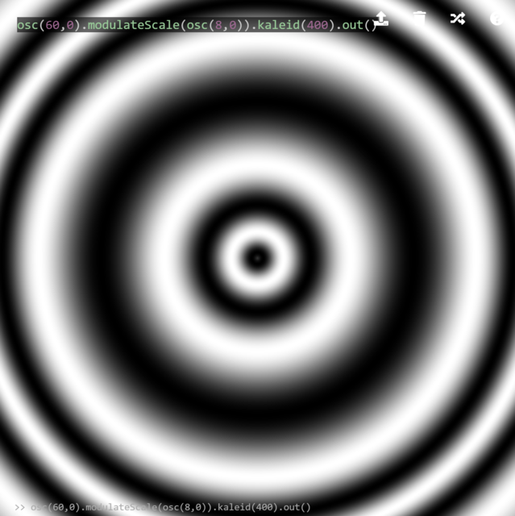

This breathing or ripple texture can be further used for modulating another texture.

```javascript
shape(400,0.5).repeat(40,40).modulate(osc(60,0).modulateScale(osc(8,0)).kaleid(400),0.02).out(o0)
```

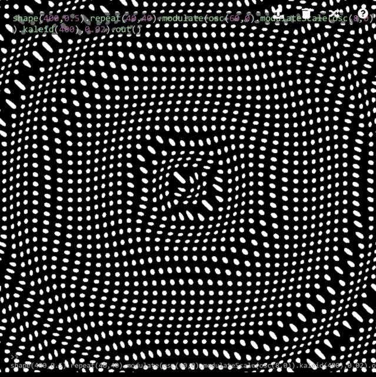

Scaling
--------

Scaling and difference can also create a periodic texture.

```javascript
shape(4,0.8).diff(src(o0).scale(0.9)).out(o0)
```

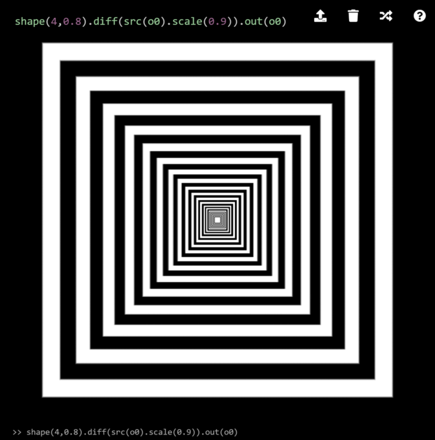

This technique can also be applied to a complex texture.

```javascript
voronoi(10,0).diff(src(o0).scale(0.9)).out(o0)
```

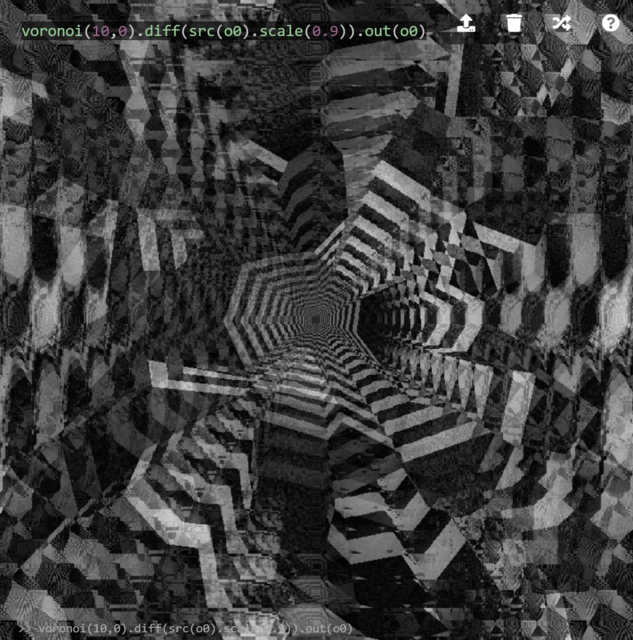

The effect can be enhanced by `thresh` and setting the third argument of `voronoi` to 0, to have sharp edges. However, a naive implementation will end up in a complete noise (notice that `thresh(threshold, tolerance)`'s `tolerance` has to be always bigger than 0).

```javascript
voronoi(10,0,0).thresh(0.5,0.01).diff(src(o0).scale(0.9)).out(o0)
```

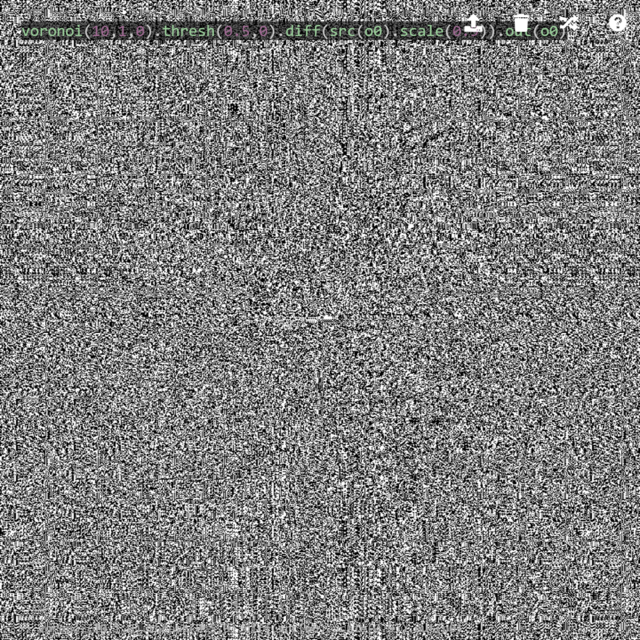

To have a desired effect, apply a square mask (before trying the next example, apply `solid().out(o0)` to clear the buffer).

```javascript
voronoi(10,0,0).thresh(0.5,0.01).mask(shape(4,0.8,0.01)).diff(src(o0).scale(0.9)).out(o0)
```

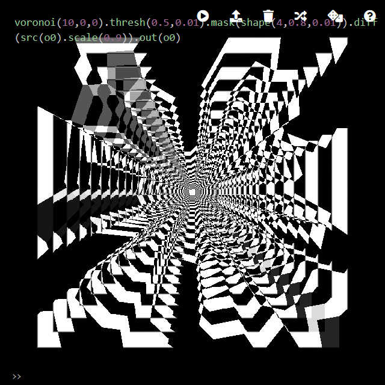

This example can be used together with rotation.

```javascript
shape(4,0.9).diff(src(o0).scale(0.9).mask(shape(4,0.9,0.01)).rotate(0.1)).out(o0)
```

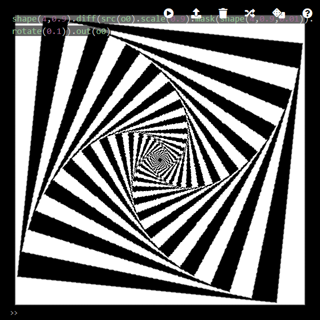

Or, instead of `scale`, scrolling functions (`scrollX` and `scrollY`) can be used with a feedback loop.

```javascript
shape(4,0.7).diff(src(o0).scrollX(0.01).mask(shape(4,0.7))).out(o0)
```

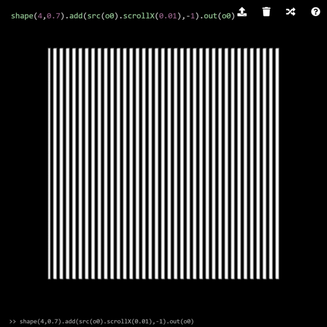
